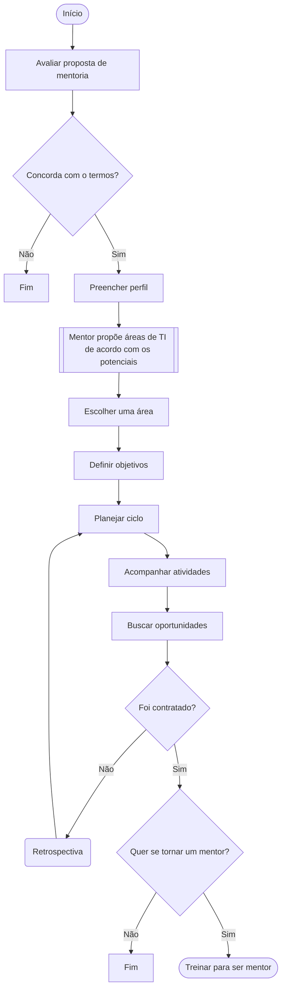

# Metodologia utilizada na mentoria

## Modelo de aprendizagem 70:20:10

Busca dentro da mentorial criar uma estratégia de semestral de estudo e prática onde o tempo deve, se possível, ser distribuído em:

* 70% a partir de experiências próprias e vivência profissional do cotidiano.
* 20% a partir de aprendizado informal e interações.
* 10% pelo aprendizado formal.

## Processo

## Entrada e Definição

